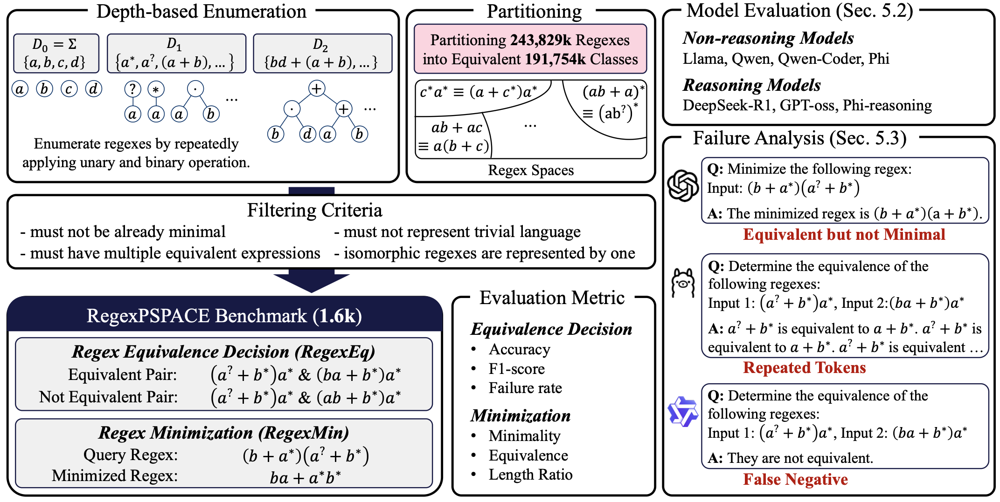

# RegexPSPACE: A Benchmark for Evaluating LLM Reasoning on PSPACE-Complete Regex Problems

<p align="center">
  <a href="https://github.com/hyundong98/RegexPSPACE/stargazers">
    
  </a>
  <a href="https://github.com/hyundong98/RegexPSPACE/commits/main">
    
  </a>
  <a href="https://github.com/hyundong98/RegexPSPACE/graphs/contributors">
    
  </a>
</p>

<div align="center">
    <a href="https://arxiv.org/abs/2510.09227"><b>Paper Link</b>📖</a>
</div><br>



## 📝 TL; DR
This paper introduces **RegexPSPACE**, a new benchmark of PSPACE-complete regex problems, to show that even state-of-the-art LLMs struggle with tasks requiring complex reasoning, thus revealing their current limitations.

## 🔍 Overview
**RegexPSPACE** is the first benchmark designed to evaluate the reasoning capabilities of Large Language Models (LLMs) on PSPACE-complete regular expression (regex) problems.

We introduce a comprehensive benchmark grounded in two PSPACE-complete regex problems: equivalence decision (RegexEQ) and minimization (RegexMin).

Through a double-exponential space exploration and a sound filtering process, we construct a benchmark of 1,685 regex problems curated from over a million initial instances.

This research presents the first empirical investigation into the spatial computational limitations of LLMs and Large Reasoning Models (LRMs), offering a new framework for evaluating their advanced reasoning capabilities.

## 📰 News
* 📣 NEW! We have released **RegexPSPACE** on our official GitHub repository. (Oct 12, 2025)
* 📣 NEW! We have released our **RegexPSPACE** preprint on arXiv. (Oct 13, 2025)

## ⚡ Quickstart
Get started in minutes by following these steps. This guide will walk you through setting up the environment, running inference on the RegexMin task, and evaluating the results.

### Step 1: Clone the Repository
```bash
git clone https://github.com/your-username/RegexPSPACE.git
cd RegexPSPACE
```

### Step 2: Set Up the Environment
Create a virtual environment and install the required dependencies.
```bash
pip install -r requirements.yaml
```

### Step 3: Run Inference
Run the model on the RegexMin task using a zero-shot prompt. The results will be saved to the ```result/``` directory.
```bash
python inference.py \
    --model-name "deepseek-ai/DeepSeek-R1-Distill-Qwen-7B" \
    --dataset-path "./data/RegexPSPACE.jsonl" \
    --task "minimization" \
    --shot "zero"
```

### Step 4: Evaluate the Results
Once inference is complete, evaluate the output to check the model's performance.
```bash
python evaluate.py \
    --model-name "deepseek-ai/DeepSeek-R1-Distill-Qwen-7B" \
    --dataset-path "./data/RegexPSPACE.jsonl" \
    --output-path "./result/minimization/zero/DeepSeek-R1-Distill-Qwen-7B_False.jsonl" \
    --task "minimization"
```
You should now see the evaluation metrics, such as Minimality, Equivalence, and Length Ratio, printed to the console.

## 📄 Introduction
While Large Language Models (LLMs) have demonstrated remarkable success in domains like mathematical reasoning and programming, their computational limits, particularly concerning spatial complexity constrained by finite context windows, remain poorly understood.
Existing benchmarks often focus on problems within the NP complexity class. We push this boundary by introducing **RegexPSPACE**, a benchmark based on PSPACE-complete problems, which serve as a more rigorous standard for assessing the computational capacity of LLMs by requiring massive search space exploration.

This project aims to empirically identify the limits of LLMs' computational capacity under spatial constraints, analyze common failure patterns, and provide a robust framework for future research into advanced reasoning capabilities.

## ✨ Key Features
- First PSPACE-Complete Benchmark: The first benchmark to evaluate LLMs on PSPACE-complete regex problems, targeting their spatial complexity and reasoning limits.

- Large-Scale Dataset: Includes the Labeled Regex Dataset (LRD) with over one million instances and the Unlabeled Regex Minimization Test set (URMT) for evaluating generalization on longer, unseen regexes.

- Quantitative Evaluation Metrics: Provides well-defined metrics beyond simple accuracy, including Minimality, Equivalence, and Length Ratio, for a nuanced analysis of model performance.

- Analysis of Failure Patterns: Identifies and analyzes common failure patterns in state-of-the-art LLMs, such as verbosity, repetition, and premature termination.

## 🛠️ Setup
### Requirements
To run this project, you need to install the dependencies listed below.

```bash
pip install -U accelerate==1.2.1 \
    bitsandbytes==0.47.0 \
    datasets==3.2.0 \
    FAdo==2.2.0 \
    scikit-learn==1.7.2 \
    seaborn==0.13.2 \
    transformers==4.55.4
```

### Dataset

The datasets used in this research are available in the `data/` directory:

* `RegexPSPACE.jsonl`: The main benchmark dataset containing 1,685 challenging regex problems.
* `RegexPSPACE_fewshot.jsonl`: Few-shot examples used for prompting the models.

## 🚀 Usage

You can use the `inference.py` script to run experiments on the **RegexPSPACE** benchmark. The script supports both zero-shot and five-shot settings for the minimization and equivalence tasks.

### Running Regex Minimization (RegexMin)

To run the minimization task in a zero-shot setting:

```bash
python inference.py \
    --model-name "deepseek-ai/DeepSeek-R1-Distill-Qwen-7B" \
    --dataset-path "./data/RegexPSPACE.jsonl" \
    --task "minimization" \
    --shot "zero"
```

### Running Regex Equivalence (RegexEQ)

To run the equivalence task in a five-shot setting:

```bash
python inference.py \
    --model-name "deepseek-ai/DeepSeek-R1-Distill-Qwen-7B" \
    --dataset-path "./data/RegexPSPACE.jsonl" \
    --task "equivalence" \
    --shot "five" \
    --fewshot-path "./data/RegexPSPACE_fewshot.jsonl"
```

### Evaluating the Results

After running inference, use the `evaluate.py` script to assess the model's performance.

```bash
python evaluate.py \
    --model-name "deepseek-ai/DeepSeek-R1-Distill-Qwen-7B" \
    --dataset-path "./data/RegexPSPACE.jsonl" \
    --output-path "./result/minimization/zero/DeepSeek-R1-Distill-Qwen-7B_False.jsonl" \
    --task "minimization"
```

## 📈 Results

Our extensive evaluations on 6 LLMs and 5 LRMs reveal several key findings:

* **Task Difficulty**: Models struggled significantly more with the minimization task compared to the equivalence task, with most models achieving less than 50% equivalence on RegexMin.
* **Model Size Dependency**: Models with 14-15B parameters or more generally outperformed their 7-8B counterparts, aligning with the intuition that larger models are better equipped for massive exploration.
* **Failure Patterns**: Common failure modes included generating repetitive token sequences and failing to complete answers within the specified token limits.

For a detailed analysis of the results and failure cases, please refer to our paper.

## Citation
```
@misc{jin2025regexpspacebenchmarkevaluatingllm,
      title={RegexPSPACE: A Benchmark for Evaluating LLM Reasoning on PSPACE-complete Regex Problems}, 
      author={Hyundong Jin and Joonghyuk Hahn and Yo-Sub Han},
      year={2025},
      eprint={2510.09227},
      archivePrefix={arXiv},
      primaryClass={cs.AI},
      url={https://arxiv.org/abs/2510.09227}, 
}
```
